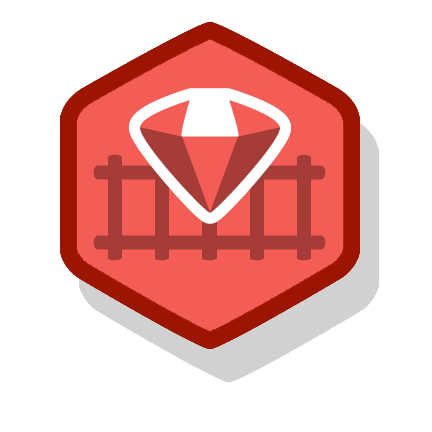

  

# BEW 1.3: Server-Side Architectures & Frameworks

| Guide | Slack | Office Hours | Shortlink | Tracker | Request 1-on-1 |
| :-: | :-: | :-: | :-: | :-: | :-: |
| [**Dani**](https://github.com/droxey) | _#bew1-3_ | Day 3:30 - 4:30pm _(Room)_ | [make.sc/bew1.3](https://make.sc/bew1.3) | [make.sc/trackbew1.3](https://make.sc/trackbew1.3) | [Click to Request](https://make.sc/codewithdani) |

## Course Description

In this course, students will learn to develop and release standardized server-side applications. Techniques include favoring convention over configuration, following a strict RESTful MVC architecture, and emphasizing the role of automated testing.

This course begins by fostering familiarity with syntactic language features, then rapidly moves into building server-side web applications and APIs. Deliverables include at least two completed and deployed applications.

## Prerequisites:

* [BEW 1.1](https://make.sc/bew1-1)

## Learning Outcomes

Students by the end of the course will be able to ...

1. Use an open-source programming language.
1. Compare and contrast common patterns for backend web development.
1. Design, implement, and deploy multiple web applications through an opinionated web framework.
1. Build SQL-based Object Relationships Manager (ORM) patterns and queries.
1. Practice automated testing paradigms.

## Schedule

**NOTE:** Due to the shorter summer sessions, for some class sessions you will see multiple topics covered. This is to ensure that we cover the same material that we normally would in non-summer terms.

**Course Dates:** Wednesday, May 29 – Wednesday, July 3, 2019 (6 weeks)

**Class Times:** Monday and Wednesday at 1:30–3:20pm (11 class sessions)

| Class |          Date          |                 Topics                | Graded Deliverable                   | Due On...    |
|:-----:|:----------------------:|---------------------------------------|--------------------------------------|-------------|
|   1   | Mon, May 27    | **Lesson 1**: [Catching the Ruby Train](01-Catching-The-Ruby-Train/README.md) | [_Presentation_](01-Catching-The-Ruby-Train/README.md#after-class) | `Day 2 @ 1:30pm` |
|   2   | Wed, May 29    | **Lesson 2**:[Rapid Ruby Syntax Sessions](02-Ruby-Presentations/README.md) |  |
|   3   | Mon, June 3    | **Lesson 3**:[Ruby Koans](03-Ruby-Koans/README.md) ||
|   4   | Wed, June 5    | **Lesson 4**: [Get on Board: Intro to Modern Rails](04-Rails-Intro/README.md) | [_RoR Tutorial_](https://guides.rubyonrails.org/getting_started.html) | `Day 10 @ 11:59pm` |
|   5   |   Mon, June 10   | **Lesson 5**: [Models: Multiple Resources, ORM, & Validation](05-Models/README.md) ||
|   6   |   Wed, June 12   | **Lesson 6**: [Controllers & Actions](06-Controllers-and-Actions/README.md) ||
|   7   |   Mon, June 17   | **Lesson 7**: [Data Driven Views](07-Views/README.md) ||
|   8   |   Wed, June 19   | **Lesson 8**: [API Design](08-API-Design/README.md) | [_API Proposal_](08-API-Design/README.md#after-class) | `11/16 @ 11:59pm` |
|   9   |   Mon, June 24   | **Lesson 9**: [Minitest = Max Results](09-Minitest/README.md) ||
|  10   |   Wed, June 26    | **Lesson 10**: [Gems](11-Gems/README.md)   **/**   **Lesson 11**: [Hands On Deployment: Heroku Tutorial](https://devcenter.heroku.com/articles/getting-started-with-rails5) |
|  11   |  Wed, July 3 | **Final Exam** | Written Exam |
|  12   |   | Fri, July 5 | **[_Custom API_](Projects/custom-api-requirements.md) Due** | `Day 12 @ 11:59pm` |

## Class Assignments

### Tutorials

Tutorials are to help you get started in a topic. They are graded on completion only.

* [Ruby on Rails Guides Tutorial](https://guides.rubyonrails.org/getting_started.html)

### Projects

* [Custom API Project](Projects/custom-api-requirements.md)
    * [Custom API Grading Rubric](Projects/custom-api-rubric.md)

## Evaluation

To pass this course you must meet the following requirements:

- Complete all required tutorials
- Pass all projects according to the associated project rubric
- Pass the final summative assessment >=75%
- Actively participate in class and abide by the attendance policy
- Make up all classwork from all absences

## Make School Course Policies

- [Program Learning Outcomes](https://make.sc/program-learning-outcomes)
- [Grading System](https://make.sc/grading-system)
- [Diversity and Inclusion Statement](https://make.sc/diversity-and-inclusion-statement)
- [Academic Honesty](https://make.sc/academic-honesty-policy)
- [Attendance Policy](https://make.sc/attendance-policy)
- [Course Credit Policy](https://make.sc/course-credit-policy)
- [Disability Services (Academic Accommodations)](https://make.sc/disability-services)
- [Student Handbook](https://make.sc/student-handbook)
