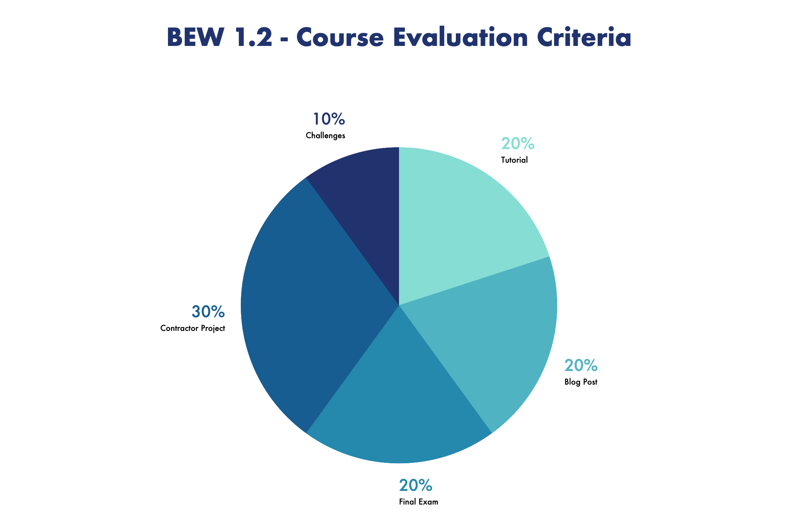

  

# BEW 1.2: Authentication, Associations, & Advanced Queries

| Instructor | Slack Channel | Course Website | Course Tracker | Documentation | Instructor 1-on-1 |
| :--------------------------------------: | :-----------: | :-:| :--------------------------------------: | :------------------------------------------------: | :-------------------------------------------: |
| [**@droxey**](https://github.com/droxey) | `#bew1-2-django`  | [make.sc/bew1.2](https://make.sc/bew1.2) | [make.sc/trackbew1.2](https://make.sc/trackbew1.2) | [Django Website](https://docs.djangoproject.com/en/3.0/) | [Click to Book](https://make.sc/codewithdani) |

1. [Course Description](#course-description)
2. [Prerequisites](#prerequisites)
3. [Learning Outcomes](#learning-outcomes)
4. [Schedule](#schedule)
5. [Evaluation](#evaluation)
6. [Class Assignments](#class-assignments)
   1. [Tutorials](#tutorials)
   2. [Projects](#projects)
7. [Make School Course Policies](#make-school-course-policies)

## Course Description

In this course, students will learn to develop and release standardized server-side applications that include authorized and authenticated users. Techniques include favoring convention over configuration, following a strict RESTful MVC architecture, and emphasizing the role of automated testing.

This course begins by fostering familiarity with framework features, then rapidly moves into building server-side web applications and APIs. Deliverables include at least two completed and deployed applications.

## Prerequisites

* [BEW 1.1](https://make.sc/bew1-1)

## Learning Outcomes

Students by the end of the course will be able to...

1. Compare and contrast configuration and convention based frameworks in backend web development.
1. Design, implement, and deploy multiple web applications via an opinionated web framework.
1. Build SQL-based Object Relationships Manager (ORM) patterns and queries.
1. Practice automated testing paradigms.

## Schedule

**Course Dates:** October 21 through December 12, 2019

| Class | Date | Topics | Assignment | Done Before |
|:-----:|:----:| :----: | :--------: | :-----------: |
|  1 |  Tue, January 21 |  [Discovering Django](Lessons/01-Discovering-Django.md) | [Requests & Responses Tutorial](https://docs.djangoproject.com/en/2.2/intro/tutorial01/) | Class 2 |
|  2 |  Thu, January 23 | [Models](Lessons/02-Models.md) | [Models Tutorial](https://docs.djangoproject.com/en/2.2/intro/tutorial02) | Class 3 |
|  3 |  Tue, January 28 | [More Models](Lessons/03-MoreModels.md) |||
|  4 |  Thu, January 30 | [Views & URLs](Lessons/04-ViewsURLs.md) | [Views & Templates Tutorial](https://docs.djangoproject.com/en/2.2/intro/tutorial03/) | Class 5 |
|  5 |  Tue, February 4 | [Templates: Tying it Together](Lessons/05-Templates.md) | [Wiki Project](https://github.com/make-school-labs/makewiki-starter): `v1` Challenges | Class 7 |
|  6 |  Thu, February 6 |  **Review Day**: [Django Core](Lessons/06-MidtermReview.md) | [Forms & Generic Views Tutorial](https://docs.djangoproject.com/en/2.2/intro/tutorial04/) | Class 8 |
|  7 |  Tue, February 11 | [Authentication & Authorization](Lessons/07-DjangoAuth.md) | [Wiki Project](https://github.com/make-school-labs/makewiki-starter): `v2` Challenges | Class 9 |
|  8 |  Thu, February 13 | [Working with Forms](Lessons/08-Forms) | |
|  9 |  Tue, February 18 | [Testing](Lessons/07-Testing.md) |  [Testing Tutorial](https://docs.djangoproject.com/en/2.2/intro/tutorial05/)| Class 10  |
| 10 |  Thu, February 20 | [Django REST Framework](Lessons/09-Django-REST-Framework.md) | [_**Contractor Project Proposal**_](Projects/proposal.md) | Class 11 |
| 11 |  Tue, February 25 | [Static Files](Lessons/10-StaticFiles.md) |  [Static Files](https://docs.djangoproject.com/en/2.2/intro/tutorial06/) & [Admin Site](https://docs.djangoproject.com/en/2.2/intro/tutorial07/) | Class 12 |
| 12 |  Thu, February 27 | [Deployment](Lessons/11-Deployment.md) ||
| 13 |  Tue, March 3 | Final Exam | Contractor Project | End of Day |

## Evaluation

  

**To pass this course, you must meet the following requirements**:

- Complete the Django Tutorial and `makewiki` project
- Write and publish two blog posts to Medium, dev.to, or a personal blog website
- Pass the [Contractor Project](Projects/requirements.md) according to the [rubric](Projects/rubric.md)
- Pass the final exam
- Actively participate in class and abide by the attendance policy
- Make up all classwork from all absences

_To pass each project or tutorial, students must earn the required number of points or higher indicated on the associated rubric. Note that all points within one project or tutorial submission are fungible (that is, interchangeable) and so if one portion of work is below the "Met All Expectations" column of the rubric, another portion of work submitted can "Exceed Expectations" (generally by completing stretch challenges) to earn an extra point to make up for the missing one. Therefore, it's wise to complete stretch challenges as "insurance" in case some work does not meet expectations._

_Another way to think of the submissions is a game where your goal is to earn enough points to pass in whatever way you see fit, with rubrics as the rules of the game that you can optimize against and "win" to pass the course._

_The instructor or teaching assistants will review students' submissions and verify or correct their self-assessed scores, then share feedback with the student through a GitHub issue opened on their repository. Feedback will include their status on that submission (that is, whether their work is passing the rubric). Resubmissions will not be considered unless the instructor has approved a resubmission in writing due to exceptional circumstances._

## Class Assignments

### Tutorials

Tutorials are to help you get started in a topic. Your progress will be reviewed by your instructor throughout the term. They are graded on completion only.

* [Django Tutorials](https://docs.djangoproject.com/en/2.2/) - These will be completed throughout the course. Reference the schedule for due dates.

### Projects

* [Contractor Project](Projects/requirements.md) ([Rubric](Projects/rubric.md))

## Make School Course Policies

- [Program Learning Outcomes](https://make.sc/program-learning-outcomes)
- [Grading System](https://make.sc/grading-system)
- [Diversity and Inclusion Statement](https://make.sc/diversity-and-inclusion-statement)
- [Academic Honesty](https://make.sc/academic-honesty-policy)
- [Attendance Policy](https://make.sc/attendance-policy)
- [Course Credit Policy](https://make.sc/course-credit-policy)
- [Disability Services (Academic Accommodations)](https://make.sc/disability-services)
- [Student Handbook](https://make.sc/student-handbook)
